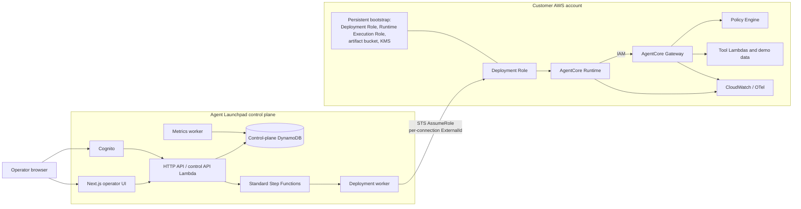

# Agent Launchpad

Agent Launchpad is a multi-tenant control plane for configuring and deploying an AI agent into a customer's AWS account with Amazon Bedrock AgentCore. The control plane owns tenant configuration, governance, lifecycle orchestration, and operator UX; the customer owns the resources that execute the agent and process its data.

> **Current status:** local architecture and security validation are implemented, but the SAY-107 cloud release gate is **not approved**. Agent-specific provisioning and ownership-checked cleanup have mocked coverage; real cloud end-to-end evidence is still outstanding. See the [validation report](docs/validation-report.md).

## What the demo proves

- Tenant-scoped control-plane records and operator authorization.
- Cross-account deployment using STS temporary credentials, not stored customer keys.
- A Node.js 22 AgentCore Runtime with IAM/SigV4 invocation and Gateway-backed tools.
- Deterministic Cedar policy enforcement: the LLM can request an action; the LLM cannot authorize it.
- Idempotent, asynchronous lifecycle records; immutable Runtime versions; production endpoint promotion; and endpoint-only rollback.
- Safe execution summaries, audit events, and CloudWatch/OTel integration that fails open.

## Architecture



### Control plane and data plane

| Plane                         | Owns                                                                                                                              | Why                                                                                             |
| ----------------------------- | --------------------------------------------------------------------------------------------------------------------------------- | ----------------------------------------------------------------------------------------------- |
| Agent Launchpad control plane | Cognito auth, tenant and agent configuration, connection metadata, lifecycle/audit records, orchestration, and operator dashboard | Centralizes governance without retaining customer workload credentials or data-plane resources. |
| Customer data plane           | AgentCore Runtime and Gateway, tool Lambdas, Policy Engine, demo support data, artifacts, and operational telemetry               | Customer workload execution and its AWS resources remain in the customer's account.             |

Normal runtime execution is between customer-owned AgentCore resources. The browser never calls STS or AgentCore directly; the operator playground intentionally invokes the configured `production` Runtime through the server-side control-plane boundary.

## Security model

### Cross-account access

The customer deploys a persistent bootstrap stack. Agent Launchpad records only allowed connection coordinates (account, Region, role ARN, and state) and creates one unique ExternalId for each AWS connection. The control plane then uses `sts:AssumeRole` and the ExternalId to obtain short-lived credentials for a bounded operation. Those credentials are not persisted or sent to the browser.

The ExternalId protects against the confused-deputy problem: a customer role trusts both the exact control-plane principal and the value generated for that connection, so another customer cannot reuse a role ARN to induce access. A customer can revoke access by changing or removing the role trust policy.

| Identity                         | Does                                                                                                          | Does not do                                                           |
| -------------------------------- | ------------------------------------------------------------------------------------------------------------- | --------------------------------------------------------------------- |
| Control-plane execution identity | Serves authenticated API requests, starts orchestration, and assumes a verified customer Deployment Role      | Does not use customer long-lived keys or become a browser credential. |
| Customer Deployment Role         | Performs bounded lifecycle/artifact/metric work and server-side Runtime invocation with temporary credentials | Is not a broad customer Administrator role.                           |
| Runtime Execution Role           | Lets the deployed Runtime invoke only the tagged customer Gateway through IAM                                 | Does not administer the Gateway or customer account.                  |
| Gateway Service Role             | Lets AgentCore Gateway invoke expected tool Lambdas and query its Policy Engine                               | Does not have DynamoDB, IAM, or AgentCore administration permission.  |

### Runtime, Gateway, and policy

Server-side control-plane invocation is IAM/SigV4 signed and targets the stable custom `production` endpoint. The Runtime uses its dedicated IAM path to invoke the Gateway; the Gateway uses `AWS_IAM` inbound authorization and its service role invokes only configured Lambda targets. Runtime networking is intentionally `PUBLIC` for this demo: the endpoint is network reachable, but it is not anonymous—AgentCore IAM/SigV4 authorization is required and browser-direct invocation is not supported.

SAY-102 supplies the three base support tools; SAY-103 extends that Gateway with the fourth, fake/demo-only `process_refund` action for the deterministic policy demonstration:

`request → model requests process_refund → Gateway Policy Engine evaluates Cedar → permit or deny → Lambda runs only when permitted`

The current template policy is fixed at £100.00 (10,000 GBP minor units). A request such as “Refund £100.01 for order ORD-1023 because it arrived damaged” is deliberately above that policy limit. The expected result is a successful agent response with `process_refund` recorded as `DENIED` and no refund mutation. **The LLM can request an action; the LLM cannot authorize the action.**

## Lifecycle, versions, and observability

A deployment is a Standard Step Functions operation with persisted progress. Its implemented path is:

`DRAFT → validation → deterministic artifact → AWS preflight → dependencies → candidate Runtime version → readiness → health check → production endpoint promotion → READY`

Requests use idempotency keys and long-running work has retries. A candidate is checked before the custom `production` endpoint points to it, so a failed candidate does not replace the prior healthy production version. Artifacts are compiled/bundled for Node.js 22, include manifest/configuration data, receive a SHA-256 content identity, and are stored as versioned customer S3 artifacts linked to the deployment.

Runtime updates create immutable versions. AgentCore's built-in `DEFAULT` follows the newest Runtime version, but Agent Launchpad serves stable traffic through its own `production` endpoint. Rollback selects a previously known-good compatible immutable version, checks it, repoints `production`, verifies the live version, and smoke tests it. It neither rebuilds the artifact, creates a Runtime version, nor modifies `DEFAULT`.

Runtime instrumentation uses OpenTelemetry, with Runtime/Gateway/Policy CloudWatch metrics, safe execution summaries, tool-status data, and audit events. Metric or trace ingestion can be delayed. The dashboard's recent execution summaries are the immediate demo view; CloudWatch Transaction Search is an optional customer-account prerequisite for searchable spans and missing telemetry never blocks execution.

## Cleanup boundary

The intended Agent undeploy boundary is deliberately narrower than customer offboarding: Agent-owned endpoint/Runtime and agent-specific resources are separate from the shared bootstrap, Deployment Role, Runtime Execution Role, artifact bucket, KMS key, other Agents, and control-plane history/audit.

Cleanup derives its plan exclusively from server-side deployment metadata and targets only the agent endpoint, Runtime, tagged agent dependency stack, and exact versioned artifacts. It refuses ownership mismatches and never targets shared bootstrap, roles, artifact bucket, or KMS resources. Cloud cleanup E2E remains intentionally out of scope for this checkout.

## Repository map

```text
apps/web                          Next.js operator interface
services/control-api              authenticated tenant API and playground boundary
services/deployment-worker        lifecycle, Runtime promotion, rollback, and teardown guards
services/metrics-worker           customer-account metric collection
agents/customer-support           Node.js AgentCore Runtime and tool contracts
packages/schemas                  shared validated domain contracts
packages/aws                      server-only AWS, persistence, artifact, and security helpers
packages/shared                   environment and shared utilities
infrastructure/control-plane      CDK control-plane resources and state machine
infrastructure/customer-bootstrap customer-owned persistent bootstrap template
infrastructure/agent-template     Customer Support Gateway, policy, tools, and demo-data stack
docs                              validation evidence and interviewer walkthrough
```

## Local setup

Prerequisites: Node.js **22.23.0** (`.nvmrc` and `.node-version`), pnpm **11.18.0** (the root `packageManager` field), Docker Desktop for the optional local DynamoDB API path, and AWS CLI/CDK only when synthesizing or deploying AWS infrastructure. Enable pnpm with `corepack enable` if necessary.

```sh
pnpm install --frozen-lockfile
pnpm lint
pnpm format:check
pnpm typecheck
pnpm test
pnpm build
```

Copy `.env.example` to `apps/web/.env.local` for local web development; Next.js does not load a root `.env`. It contains placeholders only. Cognito values come from control-plane CDK outputs; browser origins are CDK configuration; the customer bootstrap produces customer-owned AWS resources. Never commit AWS secret keys, STS tokens, Cognito secrets, or an ExternalId.

Start the web UI with `pnpm dev`. For the local control API, Docker is required:

```powershell
docker compose up -d dynamodb-local
pnpm --filter @agent-launchpad/control-api local:reset
$env:LOCAL_CONTROL_API = '1'
$env:CONTROL_API_PORT = '4000'
pnpm --filter @agent-launchpad/control-api local:serve
```

`local:reset` is idempotent and affects only Docker's `dynamodb-local-data` volume. It seeds two tenants, an active template, and draft agents; it is not a customer-data-plane demo seed. `docker compose down -v` deletes that local volume.

### AWS setup and synthesis

Use only disposable/test accounts for experimental deployments. Explicitly select account and Region; the CDK application refuses to infer them from arbitrary active credentials. Follow the [control-plane runbook](infrastructure/control-plane/README.md) for required environment variables, then run its exact `bootstrap`, `synth`, `diff`, and `deploy:dev` commands. The customer bootstrap is documented in [its package README](infrastructure/customer-bootstrap/README.md).

After the workspace build, these non-destructive synth commands validate the infrastructure assemblies:

```sh
pnpm --dir infrastructure/customer-bootstrap run synth
pnpm --dir infrastructure/agent-template run synth
pnpm --dir infrastructure/control-plane run synth
```

The control-plane synth needs its explicit environment contract; use non-production placeholders only when synthesizing rather than deploying. `pnpm validate:aws-e2e` is a destructive, opt-in release gate. It fails closed without its complete, explicit disposable-account contract and never selects a target from ambient credentials. See the [runner contract](docs/say-107-e2e-runner.md).

For a control-plane-only synthesis in PowerShell, pass the full explicit, non-production contract:

```powershell
$env:CONTROL_PLANE_DEV_ACCOUNT = '123456789012'
$env:CONTROL_PLANE_DEV_REGION = 'ap-south-1'
$env:CONTROL_PLANE_DEV_WEB_ORIGIN = 'http://localhost:3000'
$env:CONTROL_PLANE_DEV_CUSTOMER_BOOTSTRAP_TEMPLATE_URL = 'https://example.invalid/agent-launchpad/customer-bootstrap.template.json'
pnpm --dir infrastructure/control-plane run synth
```

## Demo walkthrough

The agent-template stack contains deterministic fake data: `ORD-1023` for `demo.customer@example.test`, status `IN_TRANSIT`, total £150.00, and no refund. Its CloudFormation custom resource upserts that record during stack create/update, but the repository has no standalone customer-account seed/reset command. Do not claim that a stack update resets mutable refunds or tickets.

For a reliable 3–5 minute interviewer walkthrough, have a known-good deployed agent, a completed deployment detail, and untouched canonical demo data ready before the call. Do not rely on a cold AWS deployment or fresh CloudWatch datapoint completing on camera. The operational script, preflight checklist, console views, talking points, and fallbacks are in [docs/demo-script.md](docs/demo-script.md).

## Deliberate tradeoffs

- A separate control plane adds infrastructure but preserves customer-owned execution and a clear trust boundary.
- AssumeRole plus ExternalId requires customer bootstrap but avoids long-lived customer AWS keys.
- Step Functions adds a service dependency but provides persisted retry/idempotency semantics for long operations.
- Deterministic artifacts and immutable versions add metadata but make deployment evidence and rollback auditable.
- A custom `production` endpoint adds lifecycle work but keeps failed candidates away from stable traffic.
- AgentCore Policy adds policy management but keeps authorization outside probabilistic LLM reasoning.

## Limitations and next steps

- Only the Customer Support template is implemented; its order, ticket, and refund integration is demo data.
- Gateway/tools/policy must currently be preprovisioned by the separate agent-template stack; the deployment worker does not provision or reconcile that stack.
- Runtime networking is intentionally `PUBLIC`; there is no VPC/private networking path. The threat model is network reachability protected by mandatory AgentCore IAM/SigV4 authorization, not an unauthenticated public endpoint.
- There is no AgentCore Memory/conversation persistence.
- Transaction Search needs one-time customer account setup and telemetry ingestion is asynchronous.
- A connection has one configured deployment Region; model support is limited to the catalogued Regions.
- The release gate is not approved until its direct AWS evidence report records every required SAY-107 check as `PASS`.

Likely follow-up work includes additional templates, environment promotion, private networking, policy-authoring UX, cost controls, and multi-Region resilience. None is part of this repository's current demo.

## Validation

Read the [SAY-107 validation report](docs/validation-report.md) before treating the project as release-ready. It records the local checks and the scope they cover: tenant isolation, ExternalId exposure prevention, Runtime/Gateway IAM construction, policy/tool behavior, idempotency, rollback, fail-open observability, and cleanup isolation guards. It also documents why the cloud release/security gate remains FAIL.
